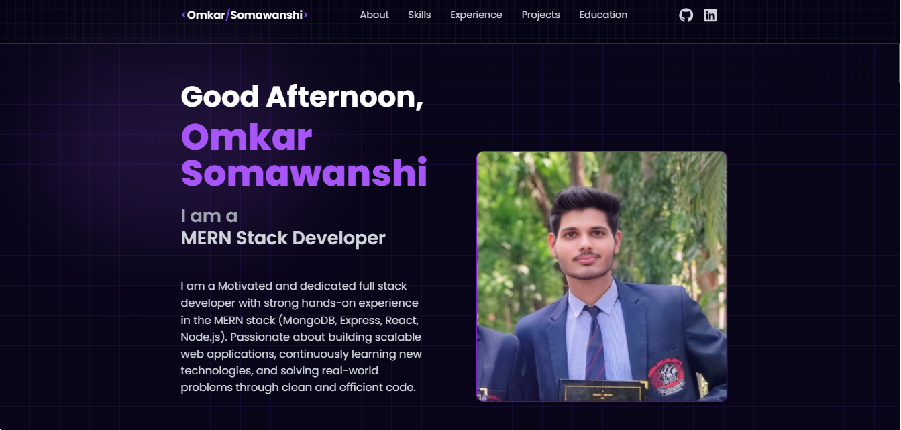
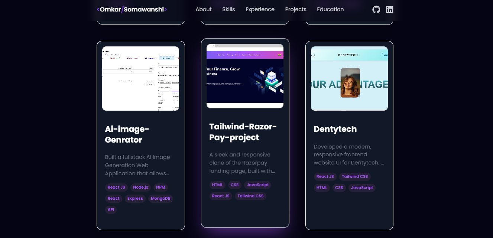
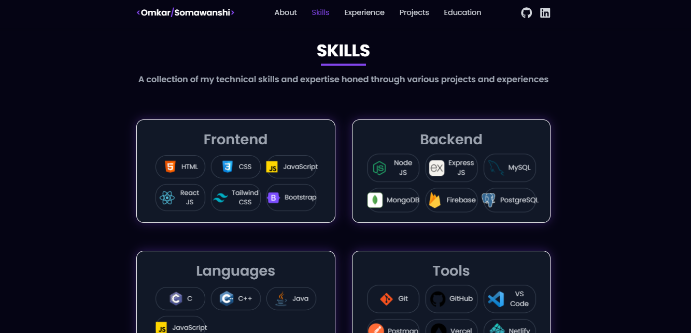

# 🚀 Omkar Somawanshi — Developer Portfolio

Welcome to my personal portfolio! This project showcases my skills, projects, and experience as a software developer. It's designed to give visitors a clean, modern, and interactive way to explore who I am and what I do.

## 🧠 About the Project

This project is my digital identity — a place where I present my **technical skills**, **projects**, **work experience**, and **contact information** in an elegant and modern format.

Designed to be visually appealing and functional on all devices, it integrates modern UI techniques such as **3D visuals**, **smooth animations**, and **dynamic content rendering**.

## 📸 Screenshots

### 💻 Home Page

### 📂 Projects Section

### 🙋‍♂️ Skills

## ⚙️ Features

- ✅ Fully responsive layout (mobile/tablet/desktop)
- 🎯 Interactive "About Me" section with typing effect
- 🚀 Projects section with GitHub and Live Demo links
- 💡 3D animated tech sphere (React Three Fiber)
- 🌈 Glowing text and glassmorphism effects
- 🎥 Scroll animations using Framer Motion
- 📫 Contact form integrated with email sending (optional)
- 🔐 SEO-ready meta tags and clean structure

